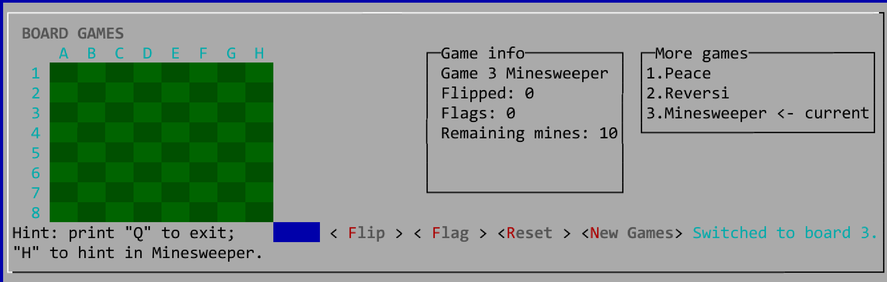
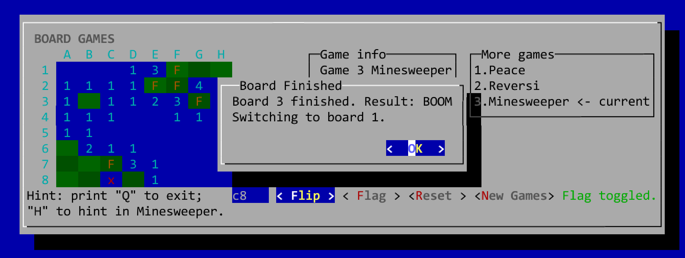
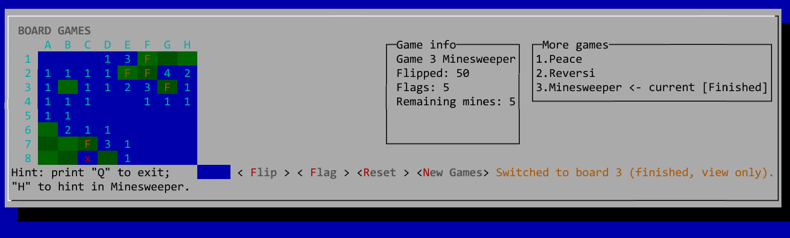
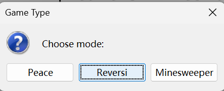
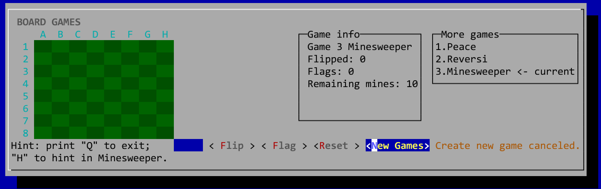

# 1.预估修改内容

- [x] 对 Move.java 的名称进行修改(改为 ProcessInput.java)，并将输入内容的判断迁移到了ProcessInput 中，通过枚举类型 Action 来返回不同的业务需求；
- [x] 将整体框架进行重构，将 Reversi 游戏剥离为一个在 Board.java 中实现的接口，以方便新增 Minesweeper 功能；

- [x] 通过构建 MinesweeperBoardAdapterView 等文件将 Minesweeper 的功能落地；
- [x] 在 TerminalUI 当中对具体的交互提示进行修改与模式适配；
- [x] 将框架逻辑进行微调，让大模型针对开局、结算、提示、切换对局等情况的逻辑细节进行修正；
- [x] 将原来的“调整尺寸”功能删除，以避免在扫雷模式中产生错误。

# 2. 增量设计点

- [x] 新增了 Minesweeper 游戏模式，并对相应的 UI 文本提示做了个性化处理；
- [x] 鉴于游戏的特性，同时为了方便进行测试，在 Minesweeper 模式中新增了提示功能：输入'H' 键即可获取提示(随机翻开一个安全的格子)；
- [x] 在 Minesweeper 模式下将悔棋功能 'U' 静默化，以免出现不符合游戏内容的结果；
- [x] 在结算对话框、新建游戏对话框等窗口进行修改；

# 3.新增/修改的关键类与职责

- GameSession.java
   - 在将 Reversi 进行解耦之后重新插入的统一接口，定义了游戏的通用能力(比如建立棋盘，处理输入，创建新游戏等)
- BoardView.java
   - 棋盘的基础视图接口，用以控制棋盘大小、单元格内容、满盘判断等功能。
- ReversiBoardView.java
   - Reversi 专用的棋盘接口，用以实现 Reversi 的个性化功能(包括落子判断等功能)。
- MinesweeperBoardView.java
   - 扫雷的专用棋盘接口，定义了扫雷格子的状态常量及翻开、插旗等方法。
- ProcessInput.java
   - 用以解析用户的输入，将其转化为结构化命令。
- TurnResult.java
   - 作为一个单次操作的结果枚举，用以将执行结果同样进行格式化处理。包括内容：成功、输入非法、位置已占用、非法落子、轮次跳过、游戏结束等。
- MinesweeperGame.java
   - 扫雷的规则实现类，将扫雷的独有规则进行封装，负责翻开格子、插旗、提示、撤销、判断是否结束，以及统计翻开数和旗子数。
- MinesweeperBoard.java
   - 这是扫雷的底层棋盘数据结构，保存每个格子的当前状态和答案状态，负责随机布雷、翻开、安全格递归展开、插旗切换、判断是否踩雷和是否清空。
- MinesweeperBoardAdapter.java
   - 这是扫雷棋盘的适配器，用以让 UI 正常显示棋盘。

# 4.扫雷核心规则说明

- 玩家面对的是一个 8×8 的棋盘格，当翻开第一个格子之后，在剩余的 63 个格子中将会随机分布 10 枚地雷。
- 玩家可以使用 Flip 交互按钮翻开格子，也可以使用 Flag 按钮标记地雷。
- 翻开格子时，将会出现下列情况之一：
   - 翻开的格子周围八个格子没有地雷：不显示额外内容，格子背景色改为蓝色；
   - 翻开的格子周围八个格子含有地雷：将会显示一个数字，数字大小代表周围地雷数目；
   - 翻开的格子是地雷：直接跳出提示：游戏失败。
- 本次 lab 内容并未使用 DFS 算法进行优化，所以一次只能翻开单个格子；
- 鉴于上述原因，在作业中增加了 Hint 功能：输入 'H' (不区分大小写)可以获得提示：随机翻开一个安全格。

# 5.多对局与动态新增流程截图

> 开局时输入 3 即可切换到 Minesweeper 游戏。

> 当失败时，便会跳出界面，提示你游戏失败。

> 当跳转回去后，可以通过 reset 功能重新开始游戏（用的随机数时间种子是不一样的，所以不会复现已失败的游戏）

> 当所有安全格翻开后，结束游戏。

> 在新建游戏的界面也进行了 UI 的修改。

> 此外，对以前未排查的一个 bug 进行了处理:旧版本中，当选中 New Games 时，无论选择棋盘还是关闭对话框，都会新建一个棋盘(若选择关闭则会依照缺省情况进行判定)现在将会取消并给出提示。

