# phase_1:

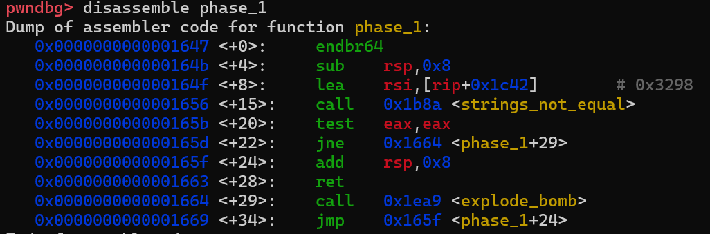

很明显，这是一个比较字符串的过程：假如你输入的结果与地址0x3298处的内存不相同，则直接跳转至explode_bomb()指令。因此，我们需要获取此处的字符串内容。

在gdb环境下输入

```gdb
x/bs 0x3298
```

即可获取本题答案。  

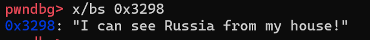

> I can see Russia from my house!

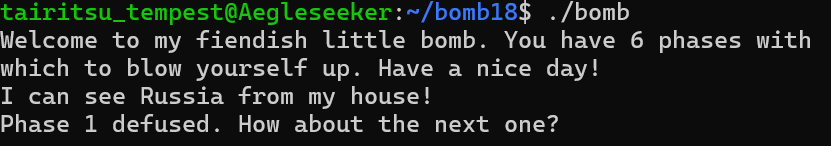

# phase_2:

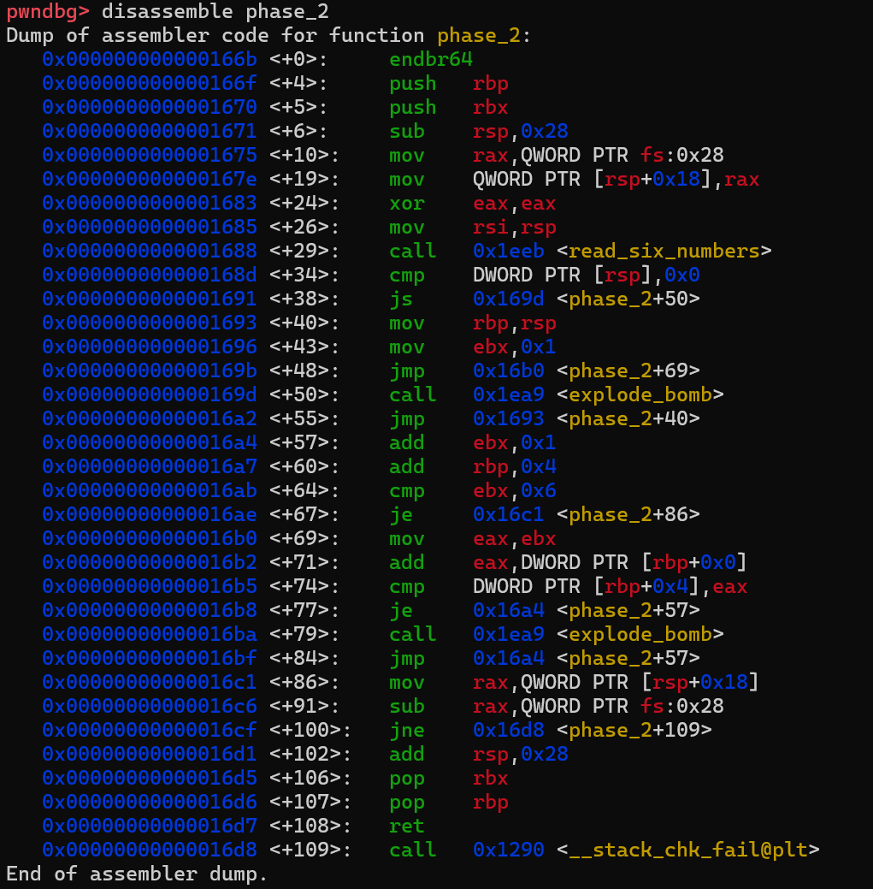

从这里开始，代码逻辑就不是那种“一眼望到底”的简单类型了。我们需要对它进行精细拆解。

```c
unsigned int64 fastcall phase_2(int a1){
  int*v1;
  int i;
  int v4[6];
  unsigned int v5;

  v5 = __readfsqword(0x28u);
  read_six_numbers(a1, v4);
  if(v4[0]<0)
    explode_bomb();
  v1=v4;
  for(i=1;i!=6;++i){
    if(v1[1]!=*v1+i)
      explode_bomb();
    ++v1;
  }
  return v5-__readfsqword(40);
}
```

也就是说，我们需要构造一个递增数列，其中满足：
$$
a_{i+1}=a_i+i(1\le i\le5)
$$
不妨取首项为0，则答案为：

>0 1 3 6 10 15

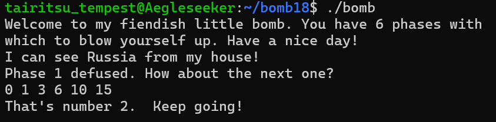

# phase_3:

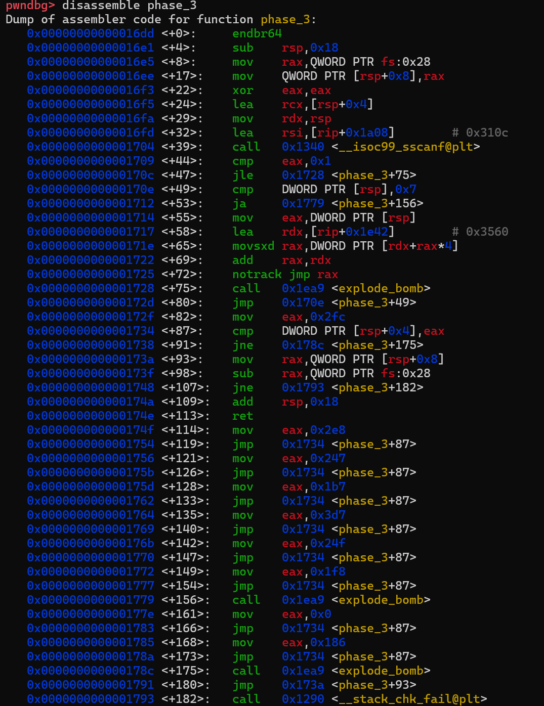

```c
unsigned int __fastcall phase_3(int a1)
{
  int n764;
  int v3;
  int n764_1;
  unsigned int v5;
  v5=__readfsqword(0x28u);
  if (__isoc99_sscanf(a1,"%d %d",&v3,&n764_1) <= 1 )
    explode_bomb();
  switch(v3){
    case 0:
      n764=764;
      break;
    case 1:
      n764=390;
      break;
    case 2:
      n764=744;
      break;
    case 3:
      n764=583;
      break;
    case 4:
      n764=439;
      break;
    case 5:
      n764=983;
      break;
    case 6:
      n764=591;
      break;
    case 7:
      n764=504;
      break;
    default:
      explode_bomb();
  }
  if(n764_1!=n764)
    explode_bomb();
  return v5-__readfsqword(0x28u);
}
```

这题很简单，只需要满足：

- 第一个数有对应的非default switch分支；

- 执行switch的时候，第二个数跟第一个数对应的switch分支相同；

就可以了。

> 0 764

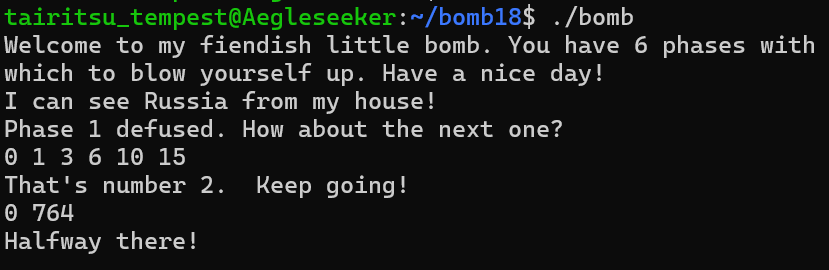

# phase_4:

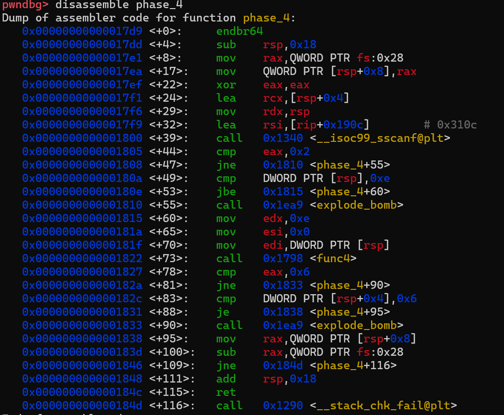

```c
unsigned int __fastcall phase_4(int a1)
{
  unsigned int n0xE;
  int n6;
  unsigned int v4;
  v4=__readfsqword(0x28u);
  if(__isoc99_sscanf(a1,"%d %d",&n0xE,&n6)!=2||n0xE>0xE)
    explode_bomb();
  if(func4(n0xE,0,14)!=6||n6!= 6 )
    explode_bomb();
  return v4-__readfsqword(0x28u);
}
```


查看此处的func4内容：

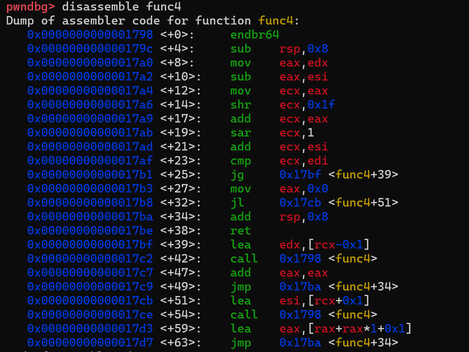

可以发现，func4的逻辑可以还原为下方的func4(类似二分查找).可以通过下方的逻辑找到这个所需的

```c
#include<stdio.h>
int func4(int a1,int a2,int a3){
    int mid=(a3+a2)/2;
    if(mid>a1){
        return func4(a1,a2,mid-1)*2;
    }
    else if(mid<a1){
        return func4(a1,mid+1,a3)*2+1;
    }
    else{
        return 0;
    }
}
int main(){
    int i;
    for(i=1;i<15;i++){
        if(func4(i,1,14)==6){
            printf("%d ",i);
        }
    }
    return 0;
}
```
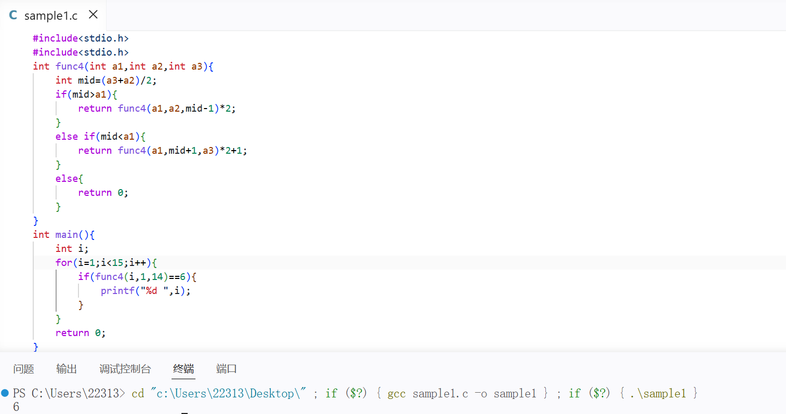

输出结果是6，答案为：

> 6 6

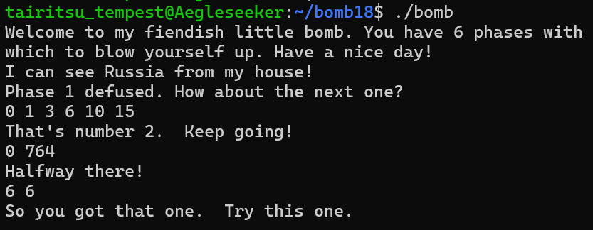

# phase_5:


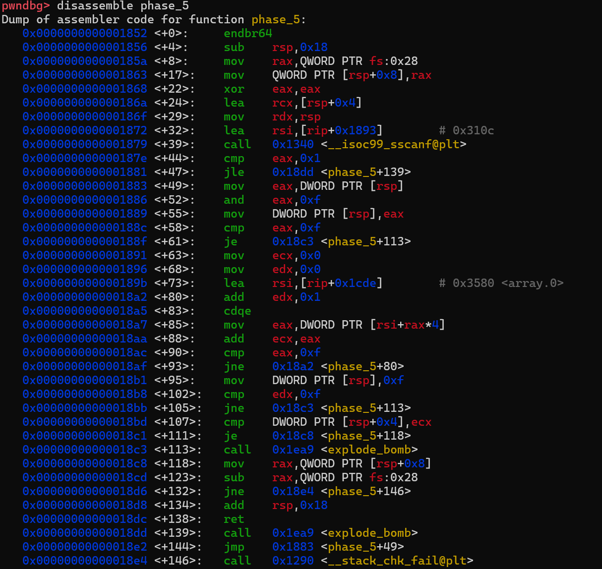

拆解过后的伪代码大致可以还原为：

```c
unsigned int fastcall phase_5(int a1)
{
  int n15;
  int v2; 
  int n15_2; 
  int n15_1; 
  int v6; 
  unsigned int v7; 
  v7=__readfsqword(0x28u);
  if(__isoc99_sscanf(a1,"%d %d",&n15_1,&v6) <= 1 )
    explode_bomb();
  n15=n15_1&0xF;
  n15_1=n15;
  if(n15==15)
    goto LABEL_7;
  v2=0;
  n15_2=0;
  do{
    ++n15_2;
    n15=array_0[n15];
    v2+=n15;
  }
  while(n15!=15);
  n15_1=15;
  if(n15_2!=15||v6!= v2)
LABEL_7:
    explode_bomb(a1);
  return v7-__readfsqword(0x28u);
}
```

简而言之，我们需要保证：

- 输入的n15（即第一个数）的后四位不能是15；
- n15将进行操作：将n15改为array_0[n15]，循环15次之后正好到15；
- v6等于除了n15初始值剩下的元素之和

注意到这里的注释,我们寻找0x3580地址的数据:(注意读取顺序)
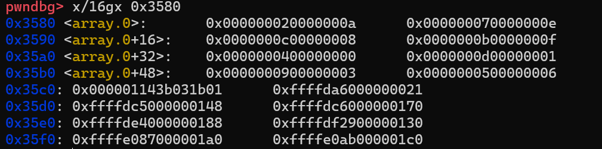

> 拆解array_0:{10,2,14,7,8,12,15,11,0,4,1,13,3,9,6,5}
> 15<-6<-14<-2<-1<-10<-0<-8<-4<-9<-13<-11<-7<-3<-12<-5<-15

> 5 115

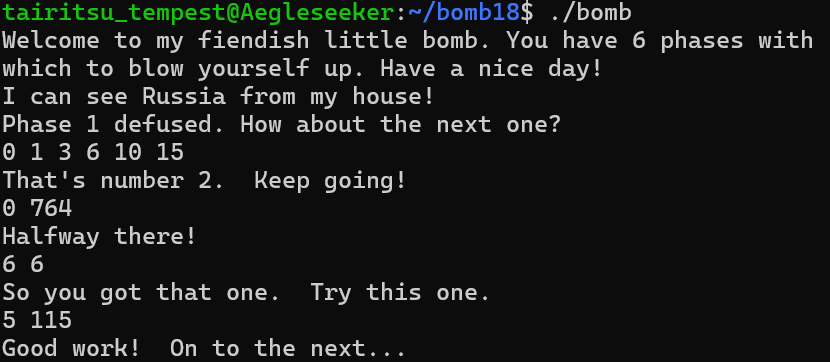

# phase_6

> 这个实在太长了，截图截不下来，，

```bash
pwndbg> disassemble phase_6
Dump of assembler code for function phase_6:
   0x00000000000018e9 <+0>:     endbr64
   0x00000000000018ed <+4>:     push   r14
   0x00000000000018ef <+6>:     push   r13
   0x00000000000018f1 <+8>:     push   r12
   0x00000000000018f3 <+10>:    push   rbp
   0x00000000000018f4 <+11>:    push   rbx
   0x00000000000018f5 <+12>:    sub    rsp,0x60
   0x00000000000018f9 <+16>:    mov    rax,QWORD PTR fs:0x28
   0x0000000000001902 <+25>:    mov    QWORD PTR [rsp+0x58],rax
   0x0000000000001907 <+30>:    xor    eax,eax
   0x0000000000001909 <+32>:    mov    r13,rsp
   0x000000000000190c <+35>:    mov    rsi,r13
   0x000000000000190f <+38>:    call   0x1eeb <read_six_numbers>
   0x0000000000001914 <+43>:    mov    r14d,0x1
   0x000000000000191a <+49>:    mov    r12,rsp
   0x000000000000191d <+52>:    jmp    0x19f6 <phase_6+269>
   0x0000000000001922 <+57>:    call   0x1ea9 <explode_bomb>
   0x0000000000001927 <+62>:    cmp    r14d,0x5
   0x000000000000192b <+66>:    jle    0x1a13 <phase_6+298>
   0x0000000000001931 <+72>:    jmp    0x195a <phase_6+113>
   0x0000000000001933 <+74>:    add    rbx,0x1
   0x0000000000001937 <+78>:    cmp    ebx,0x5
   0x000000000000193a <+81>:    jg     0x19ee <phase_6+261>
   0x0000000000001940 <+87>:    mov    eax,DWORD PTR [r12+rbx*4]
   0x0000000000001944 <+91>:    cmp    DWORD PTR [rbp+0x0],eax
   0x0000000000001947 <+94>:    jne    0x1933 <phase_6+74>
   0x0000000000001949 <+96>:    call   0x1ea9 <explode_bomb>
   0x000000000000194e <+101>:   jmp    0x1933 <phase_6+74>
   0x0000000000001950 <+103>:   add    r14,0x1
   0x0000000000001954 <+107>:   cmp    r14,0x7
   0x0000000000001958 <+111>:   jne    0x19ce <phase_6+229>
   0x000000000000195a <+113>:   mov    esi,0x0
   0x000000000000195f <+118>:   mov    ecx,DWORD PTR [rsp+rsi*4]
   0x0000000000001962 <+121>:   mov    eax,0x1
   0x0000000000001967 <+126>:   lea    rdx,[rip+0x38c2]        # 0x5230 <node1>
   0x000000000000196e <+133>:   cmp    ecx,0x1
   0x0000000000001971 <+136>:   jle    0x197e <phase_6+149>
   0x0000000000001973 <+138>:   mov    rdx,QWORD PTR [rdx+0x8]
   0x0000000000001977 <+142>:   add    eax,0x1
   0x000000000000197a <+145>:   cmp    eax,ecx
   0x000000000000197c <+147>:   jne    0x1973 <phase_6+138>
   0x000000000000197e <+149>:   mov    QWORD PTR [rsp+rsi*8+0x20],rdx
   0x0000000000001983 <+154>:   add    rsi,0x1
   0x0000000000001987 <+158>:   cmp    rsi,0x6
   0x000000000000198b <+162>:   jne    0x195f <phase_6+118>
   0x000000000000198d <+164>:   mov    rbx,QWORD PTR [rsp+0x20]
   0x0000000000001992 <+169>:   mov    rax,QWORD PTR [rsp+0x28]
   0x0000000000001997 <+174>:   mov    QWORD PTR [rbx+0x8],rax
   0x000000000000199b <+178>:   mov    rdx,QWORD PTR [rsp+0x30]
   0x00000000000019a0 <+183>:   mov    QWORD PTR [rax+0x8],rdx
   0x00000000000019a4 <+187>:   mov    rax,QWORD PTR [rsp+0x38]
   0x00000000000019a9 <+192>:   mov    QWORD PTR [rdx+0x8],rax
   0x00000000000019ad <+196>:   mov    rdx,QWORD PTR [rsp+0x40]
   0x00000000000019b2 <+201>:   mov    QWORD PTR [rax+0x8],rdx
   0x00000000000019b6 <+205>:   mov    rax,QWORD PTR [rsp+0x48]
   0x00000000000019bb <+210>:   mov    QWORD PTR [rdx+0x8],rax
   0x00000000000019bf <+214>:   mov    QWORD PTR [rax+0x8],0x0
   0x00000000000019c7 <+222>:   mov    ebp,0x5
   0x00000000000019cc <+227>:   jmp    0x19dd <phase_6+244>
   0x00000000000019ce <+229>:   add    r13,0x4
   0x00000000000019d2 <+233>:   jmp    0x19f6 <phase_6+269>
   0x00000000000019d4 <+235>:   mov    rbx,QWORD PTR [rbx+0x8]
   0x00000000000019d8 <+239>:   sub    ebp,0x1
   0x00000000000019db <+242>:   je     0x1a1b <phase_6+306>
   0x00000000000019dd <+244>:   mov    rax,QWORD PTR [rbx+0x8]
   0x00000000000019e1 <+248>:   mov    eax,DWORD PTR [rax]
   0x00000000000019e3 <+250>:   cmp    DWORD PTR [rbx],eax
   0x00000000000019e5 <+252>:   jle    0x19d4 <phase_6+235>
   0x00000000000019e7 <+254>:   call   0x1ea9 <explode_bomb>
   0x00000000000019ec <+259>:   jmp    0x19d4 <phase_6+235>
   0x00000000000019ee <+261>:   add    r13,0x4
   0x00000000000019f2 <+265>:   add    r14,0x1
   0x00000000000019f6 <+269>:   mov    rbp,r13
   0x00000000000019f9 <+272>:   mov    eax,DWORD PTR [r13+0x0]
   0x00000000000019fd <+276>:   sub    eax,0x1
   0x0000000000001a00 <+279>:   cmp    eax,0x5
   0x0000000000001a03 <+282>:   ja     0x1922 <phase_6+57>
   0x0000000000001a09 <+288>:   cmp    r14d,0x5
   0x0000000000001a0d <+292>:   jg     0x1950 <phase_6+103>
   0x0000000000001a13 <+298>:   mov    rbx,r14
   0x0000000000001a16 <+301>:   jmp    0x1940 <phase_6+87>
   0x0000000000001a1b <+306>:   mov    rax,QWORD PTR [rsp+0x58]
   0x0000000000001a20 <+311>:   sub    rax,QWORD PTR fs:0x28
   0x0000000000001a29 <+320>:   jne    0x1a38 <phase_6+335>
   0x0000000000001a2b <+322>:   add    rsp,0x60
   0x0000000000001a2f <+326>:   pop    rbx
   0x0000000000001a30 <+327>:   pop    rbp
   0x0000000000001a31 <+328>:   pop    r12
   0x0000000000001a33 <+330>:   pop    r13
   0x0000000000001a35 <+332>:   pop    r14
   0x0000000000001a37 <+334>:   ret
   0x0000000000001a38 <+335>:   call   0x1290 <__stack_chk_fail@plt>
```
这里涉及到了结构体的考察，考察对象是链表排序:
```c
typedef struct Node{
    int value;
    struct Node*next;
}Node;
struct Node node1; 
void phase_6(char*input){
    int nums[6];
    struct Node*nodes[6];
    read_six_numbers(input,nums);
    for(int i=0;i<6;i++){
        if(nums[i]<1||nums[i]>6)
            explode_bomb();
        for(int j=i+1;j<6;j++){
            if(nums[i]==nums[j])
                explode_bomb();
        }
    }
    for(int i=0;i<6;i++){
        struct Node*p=&node1;
        for(int j=1;j=<nums[i];j++){
            p=p->next;
        }
        nodes[i]=p;
    }
    for(int i=0;i<5;i++){
        nodes[i]->next=nodes[i+1];
    }
    nodes[5]->next=NULL;
    struct Node*cur=nodes[0];
    for(int i=0;i<5;i++){
        if(cur->value>cur->next->value)
            explode_bomb();
        cur=cur->next;
    }
}
```

具体逻辑可以理解为：内部存储了一个有六个元素的链表，要求你根据链表中表元的大小重新排序，并按照新的顺序重新输出一个原有链表序号的序列(1~6)。我们可以通过查找链表的头指针对应的值进行“顺藤摸瓜”查找：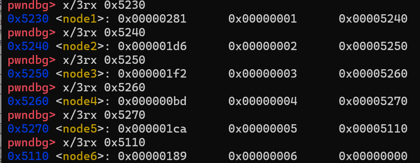

| 链表名 | value      | 序号 | next         |
| ------ | ---------- | ---- | ------------ |
| node1  | 0x281(641) | 1    | 0x5240       |
| node2  | 0x1d6(470) | 2    | 0x5250       |
| node3  | 0x1f2(498) | 3    | 0x5260       |
| node4  | 0xbd(189)  | 4    | 0x5270       |
| node5  | 0x1ca(458) | 5    | 0x5110       |
| node6  | 0x189(393) | 6    | 0x0000(NULL) |

然后进行从小到大排序，可知最后的答案应该是4 6 5 2 3 1。

> 4 6 5 2 3 1

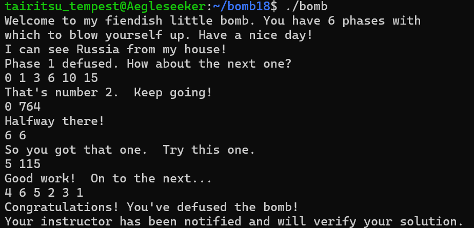

> > 结束了吗？

______

> 我去，还有第七关！


# phase_7(secret phase)

我们注意到，在一开始我们只是根据给出的bomb.c进行拆解，但是还没从gdb的角度观察过我们的文件。

(依旧太长无法截屏)

```c
pwndbg> disassemble main
Dump of assembler code for function main:
   0x00000000000014e9 <+0>:     endbr64
   0x00000000000014ed <+4>:     push   rbx
   0x00000000000014ee <+5>:     cmp    edi,0x1
   0x00000000000014f1 <+8>:     je     0x15ef <main+262>
   0x00000000000014f7 <+14>:    mov    rbx,rsi
   0x00000000000014fa <+17>:    cmp    edi,0x2
   0x00000000000014fd <+20>:    jne    0x1624 <main+315>
   0x0000000000001503 <+26>:    mov    rdi,QWORD PTR [rsi+0x8]
   0x0000000000001507 <+30>:    lea    rsi,[rip+0x1af6]        # 0x3004
   0x000000000000150e <+37>:    call   0x1370 <fopen@plt>
   0x0000000000001513 <+42>:    mov    QWORD PTR [rip+0x4196],rax        # 0x56b0 <infile>
   0x000000000000151a <+49>:    test   rax,rax
   0x000000000000151d <+52>:    je     0x1602 <main+281>
   0x0000000000001523 <+58>:    call   0x1bea <initialize_bomb>
   0x0000000000001528 <+63>:    lea    rdi,[rip+0x1ca1]        # 0x31d0
   0x000000000000152f <+70>:    call   0x1260 <puts@plt>
   0x0000000000001534 <+75>:    lea    rdi,[rip+0x1cd5]        # 0x3210
   0x000000000000153b <+82>:    call   0x1260 <puts@plt>
   0x0000000000001540 <+87>:    call   0x1f30 <read_line>
   0x0000000000001545 <+92>:    mov    rdi,rax
   0x0000000000001548 <+95>:    call   0x1647 <phase_1>
   0x000000000000154d <+100>:   call   0x2072 <phase_defused>
   0x0000000000001552 <+105>:   lea    rdi,[rip+0x1ce7]        # 0x3240
   0x0000000000001559 <+112>:   call   0x1260 <puts@plt>
   0x000000000000155e <+117>:   call   0x1f30 <read_line>
   0x0000000000001563 <+122>:   mov    rdi,rax
   0x0000000000001566 <+125>:   call   0x166b <phase_2>
   0x000000000000156b <+130>:   call   0x2072 <phase_defused>
   0x0000000000001570 <+135>:   lea    rdi,[rip+0x1ac6]        # 0x303d
   0x0000000000001577 <+142>:   call   0x1260 <puts@plt>
   0x000000000000157c <+147>:   call   0x1f30 <read_line>
   0x0000000000001581 <+152>:   mov    rdi,rax
   0x0000000000001584 <+155>:   call   0x16dd <phase_3>
   0x0000000000001589 <+160>:   call   0x2072 <phase_defused>
   0x000000000000158e <+165>:   lea    rdi,[rip+0x1ac6]        # 0x305b
   0x0000000000001595 <+172>:   call   0x1260 <puts@plt>
   0x000000000000159a <+177>:   call   0x1f30 <read_line>
   0x000000000000159f <+182>:   mov    rdi,rax
   0x00000000000015a2 <+185>:   call   0x17d9 <phase_4>
   0x00000000000015a7 <+190>:   call   0x2072 <phase_defused>
   0x00000000000015ac <+195>:   lea    rdi,[rip+0x1cbd]        # 0x3270
   0x00000000000015b3 <+202>:   call   0x1260 <puts@plt>
   0x00000000000015b8 <+207>:   call   0x1f30 <read_line>
   0x00000000000015bd <+212>:   mov    rdi,rax
   0x00000000000015c0 <+215>:   call   0x1852 <phase_5>
   0x00000000000015c5 <+220>:   call   0x2072 <phase_defused>
   0x00000000000015ca <+225>:   lea    rdi,[rip+0x1a99]        # 0x306a
   0x00000000000015d1 <+232>:   call   0x1260 <puts@plt>
   0x00000000000015d6 <+237>:   call   0x1f30 <read_line>
   0x00000000000015db <+242>:   mov    rdi,rax
   0x00000000000015de <+245>:   call   0x18e9 <phase_6>
   0x00000000000015e3 <+250>:   call   0x2072 <phase_defused>
   0x00000000000015e8 <+255>:   mov    eax,0x0
   0x00000000000015ed <+260>:   pop    rbx
   0x00000000000015ee <+261>:   ret
   0x00000000000015ef <+262>:   mov    rax,QWORD PTR [rip+0x409a]        # 0x5690 <stdin@GLIBC_2.2.5>
   0x00000000000015f6 <+269>:   mov    QWORD PTR [rip+0x40b3],rax        # 0x56b0 <infile>
   0x00000000000015fd <+276>:   jmp    0x1523 <main+58>
   0x0000000000001602 <+281>:   mov    rcx,QWORD PTR [rbx+0x8]
   0x0000000000001606 <+285>:   mov    rdx,QWORD PTR [rbx]
   0x0000000000001609 <+288>:   lea    rsi,[rip+0x19f6]        # 0x3006
   0x0000000000001610 <+295>:   mov    edi,0x2
   0x0000000000001615 <+300>:   call   0x1360 <__printf_chk@plt>
   0x000000000000161a <+305>:   mov    edi,0x8
   0x000000000000161f <+310>:   call   0x1390 <exit@plt>
   0x0000000000001624 <+315>:   mov    rdx,QWORD PTR [rsi]
   0x0000000000001627 <+318>:   lea    rsi,[rip+0x19f5]        # 0x3023
   0x000000000000162e <+325>:   mov    edi,0x2
   0x0000000000001633 <+330>:   mov    eax,0x0
   0x0000000000001638 <+335>:   call   0x1360 <__printf_chk@plt>
   0x000000000000163d <+340>:   mov    edi,0x8
   0x0000000000001642 <+345>:   call   0x1390 <exit@plt>
End of assembler dump.
```

> 观察main函数,我们可以发现每次完成一个阶段都会有一个phase_defused的函数调用。让我们观察这个函数：

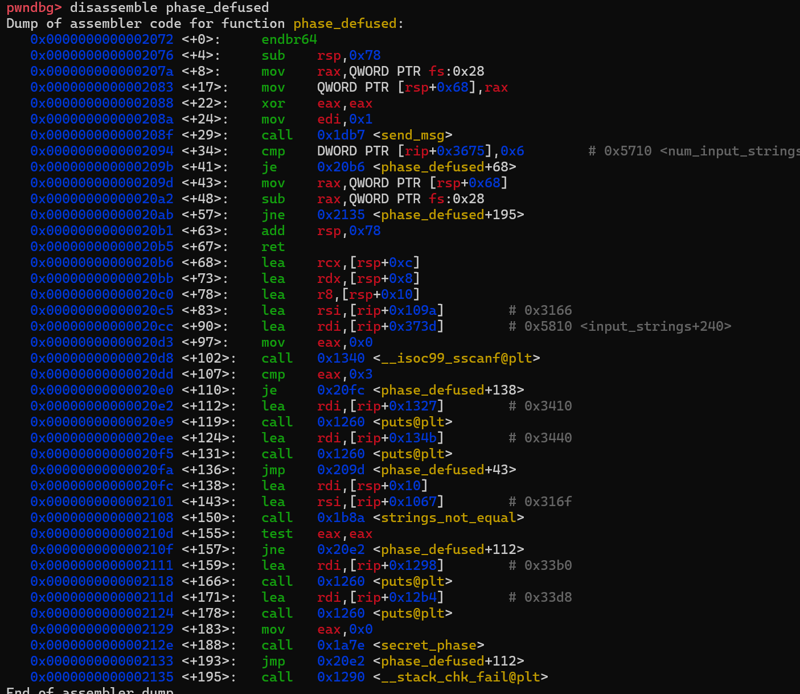

注意<+138>~<+150>这里提示我们在phase_4答案后面加入0x316f将会进入隐藏阶段。  

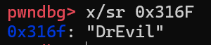

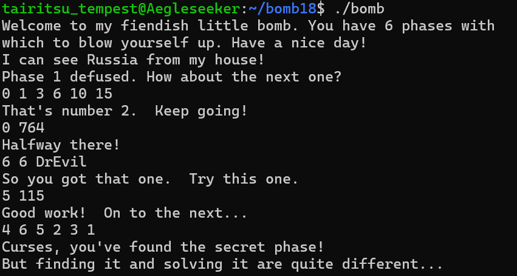

> 果不其然！

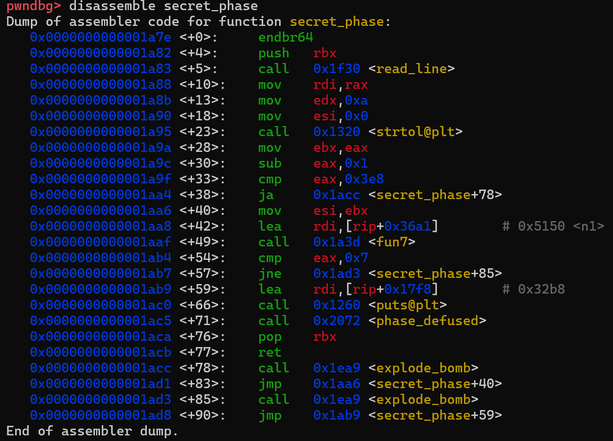
经过分析，可以将汇编代码拆解为下面的伪代码：

```c
unsigned int secret_phase(){
  const char*line;
  unsigned int v1; 
  line=(const char*)read_line();
  v1=strtol(line,0,10);
  if(v1>1001)
    explode_bomb();
  if((unsigned int)fun7(&n1,v1)!=7)
    explode_bomb();
  puts("Wow! You've defused the secret stage!");
  return phase_defused();
}
```

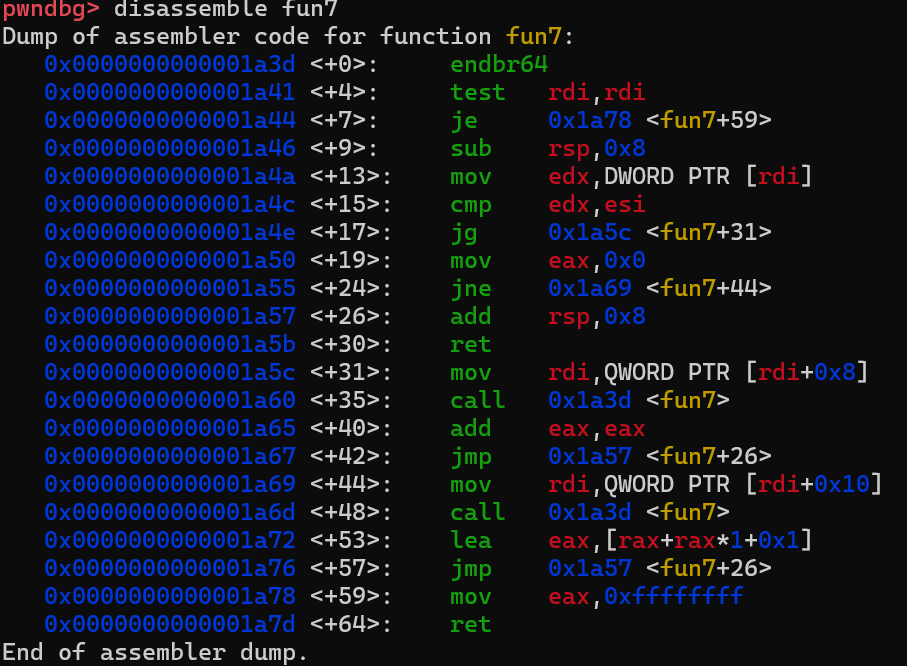

而这里的fun7也是跟前面类似的二分查找代码：

```c
int fastcall fun7(int a1,int a2){
  int result; 
  if(!a1)
    return -1;
  if(a1>a2)
    return 2*fun7((a1 + 8),a2);
  result=0;
  if(a1!=a2)
    return 2*fun7((a1 + 16),a2)+1;
  return result;
}
```

类似前面的分析可知，此处的答案应该是1001.

> 1001

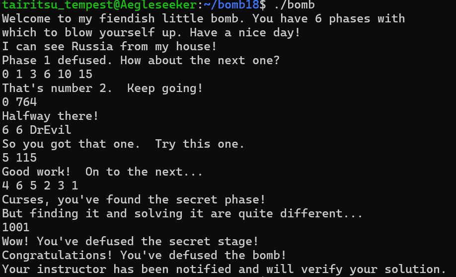

> 至此，整个bomb lab的七个阶段被全部解出。

# 注

在破解过程中，笔者发现用./bomb answer.txt的方式貌似会直接“爆炸”(即使答案是正确的)，所以采用了手动输入的方法。

为了保证还原的伪代码正确，报告中出现的所有还原代码都经过了与IDA(the Interactive DisAssembler)生成的伪代码的比对。
