# ctarget
## 1.

首先找到touch1的反汇编代码：

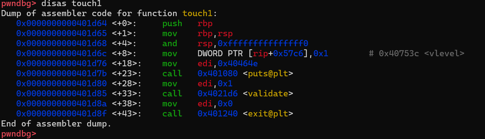

下一步，观察此处的getbuf缓冲区，发现为0x88.

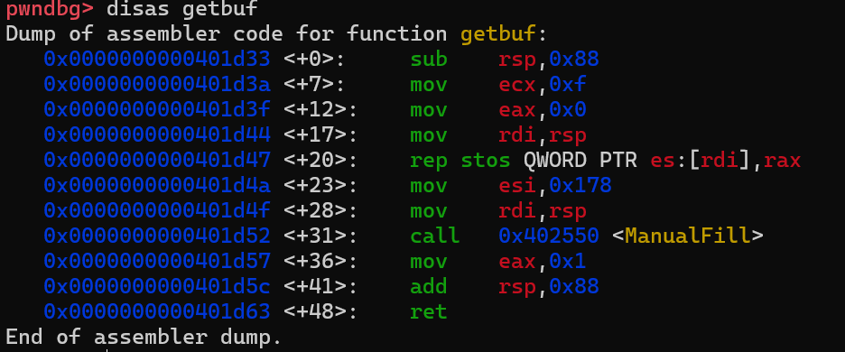

显然，在0x88处放置touch1的首地址即可完成跳转。

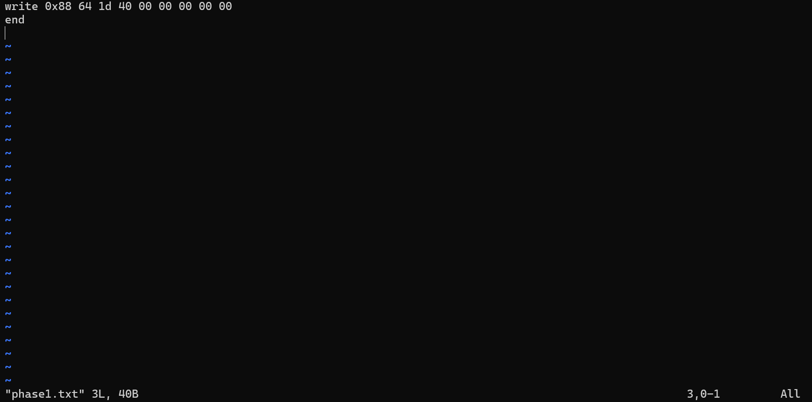

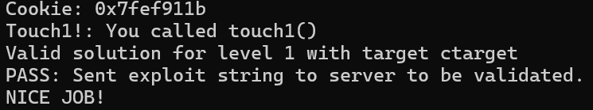

完成第一问。

## 2.

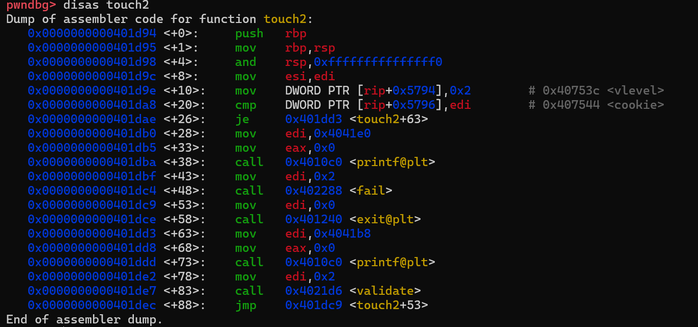

原理是比较rdi与cookie大小，如果相等则能通过。这里要求我们的shellcode为：

```bash
mov rax,0x401d94b8
push rax
mov rdi,0x7fef911b
ret
```

将断点打在getbuf的首地址，可以发现此时rsp为0x5a65a9c8,考虑getbuf的第一条指令sub rsp,0x88后发现缓冲区首地址为0x5a65a940.

计算0x5a65a9c8-0x88+0x90=0x5a65a9d0，即待跳转的位置。把这个地址放在0x88的位置上即可跳转到shellcode
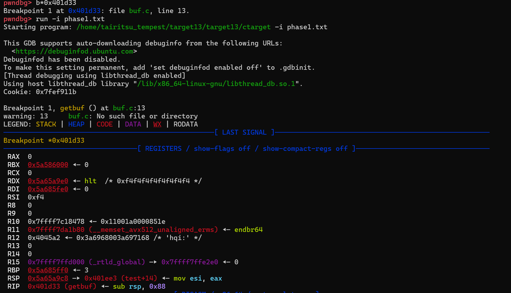

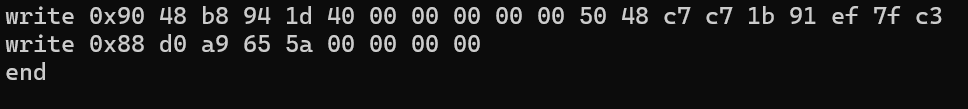

然后就能通过检测。

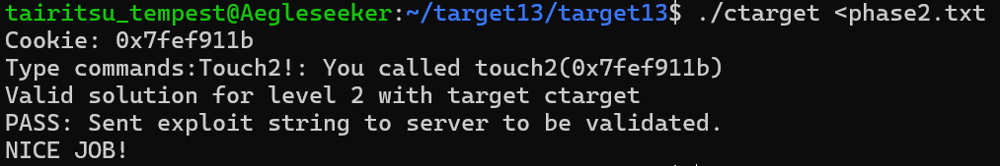

## 3.

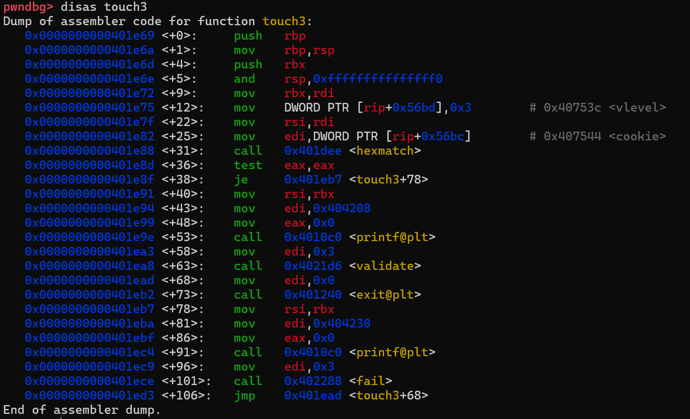

分析touch3可以发现，我们需要调用hexmatch函数：

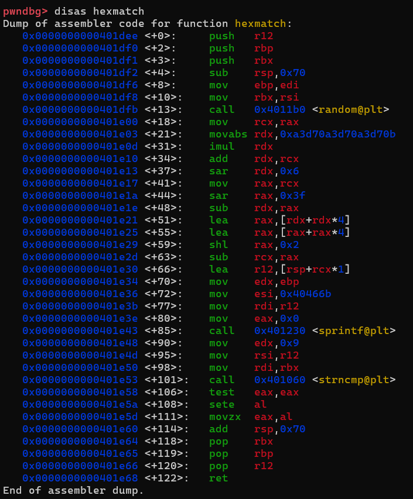

分析这里的逻辑可以发现，它会将rsp+random()%100的结果存入r12中，导致可能出现随机破坏栈帧的情况。

因此，我们需要把我们的shellcode放在一个地址更高的位置以避免被影响：注意到这里用的是字符串，需要把0x7fef911b改成'7fef911b\0'对应的ascii码。

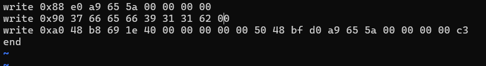

所以这里依然采用的是0x5a65a9d0(0x5a65a940+0x90)作为返回地址。

具体的逻辑结构为:

```bash
mov rax,0x40691e
push rax
mov rdi,0x5a65a9d0
ret
```

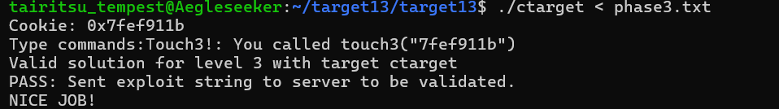

# rtarget

## 1.

第一问只需要构造出返回地址即可，所以可以直接复用前面的phase1.txt。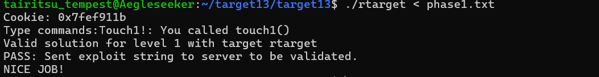

## 2.

这一问的要求是保证rdi的值，所以我们可能需要一个 mov rdi,xxx的gadget用以将cookie转移。

首先提取出farm.asm:

```bash
objdump rtarget -d rtarget.asm
sed -n '/<start_farm>:/,/<end_farm>:/p' rtarget.asm > farm.asm
```

然后在farm中搜索mov相关的字段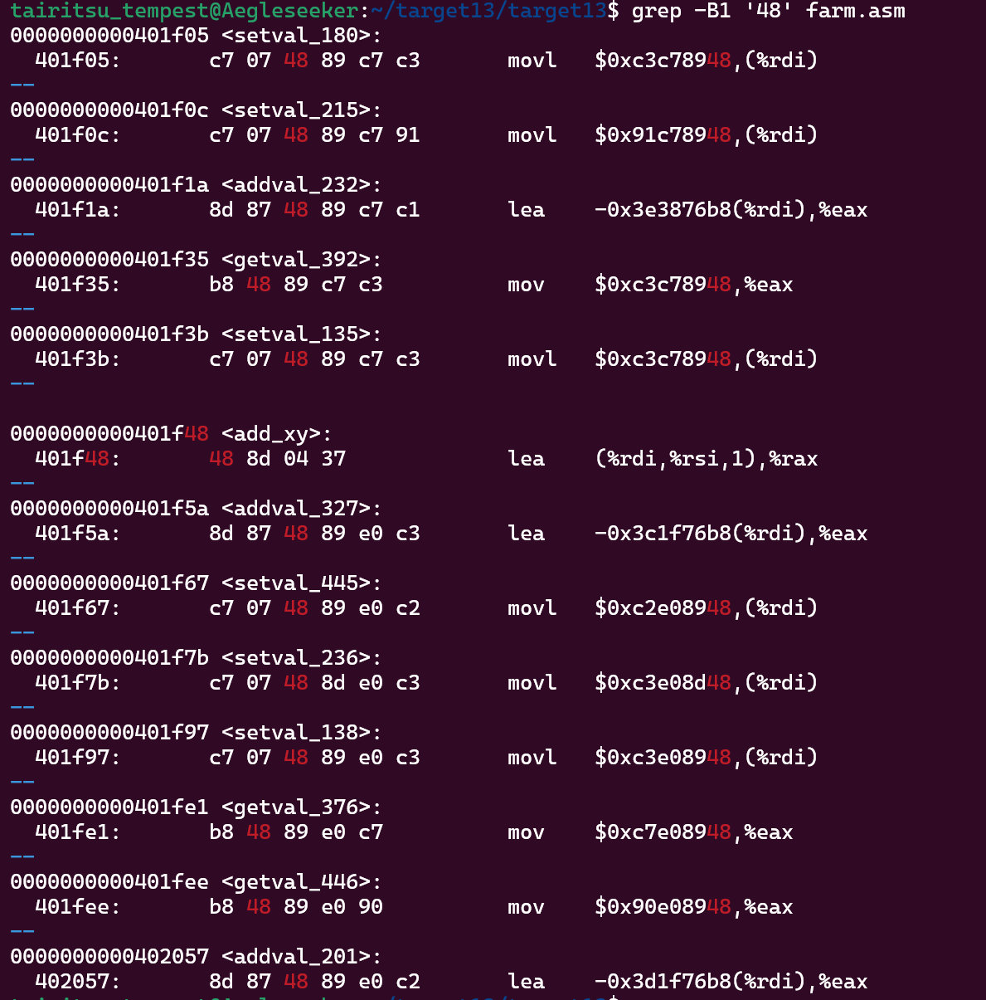

按图索骥，查找一下相关的指令：

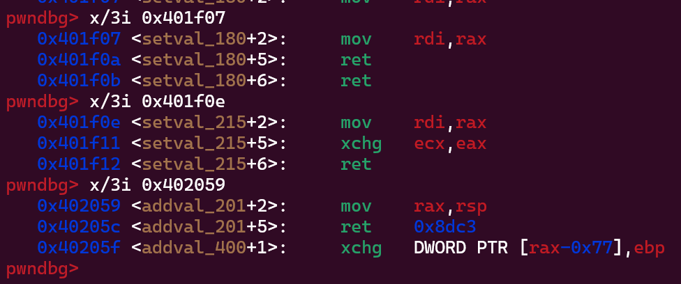

我们可以发现，这里的0x401f07就是一个比较理想的结果。那么希望得到的构造rop链是：

```bash
pop rax
ret
mov rdi,rax
ret
```

中间再加上touch2首地址跟cookie即可。

下一步查找pop rax:

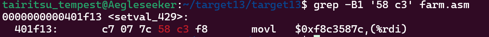

那么这里的58 c3对应的pop rax;ret就是我们需要得到的内容。

具体的shellcode构造如下：

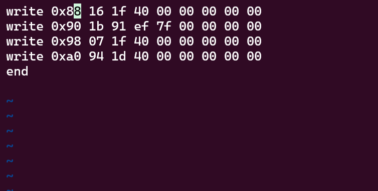

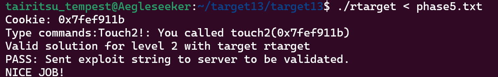

## 3.

这一问由于加入了随机栈的因素，相比前者会稍微复杂一些。

