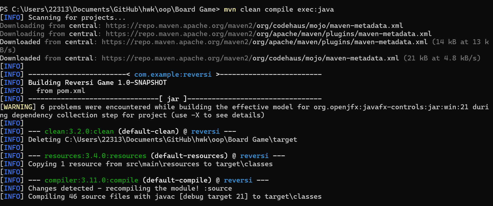
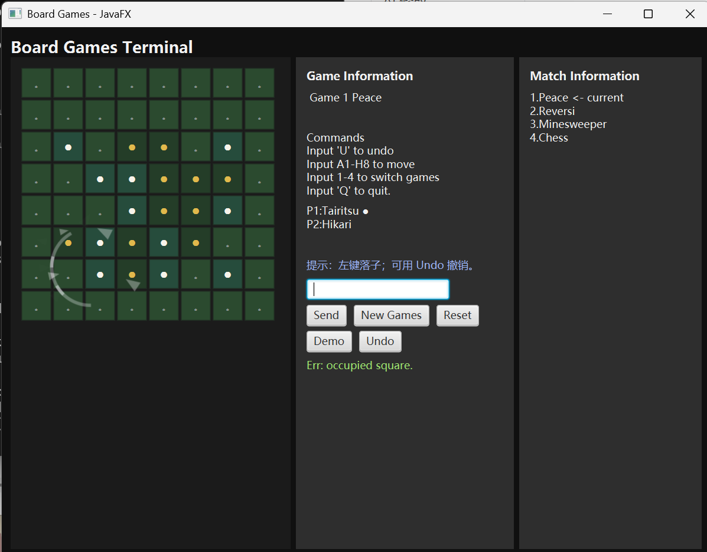
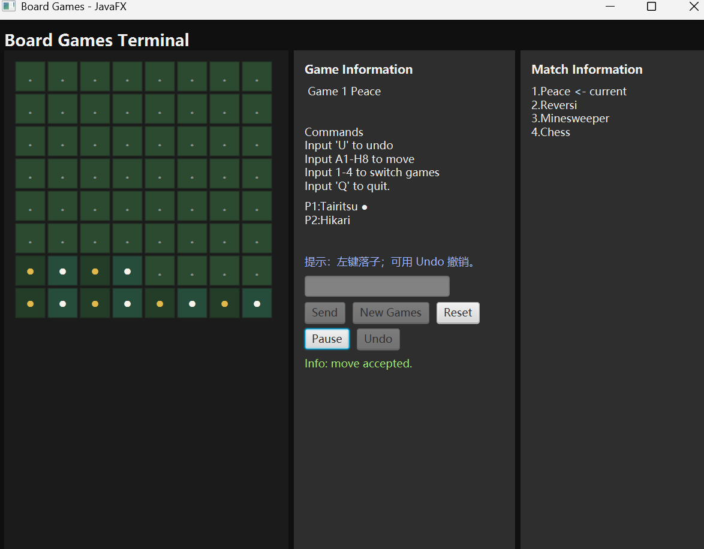

## 1.预估修改内容与 AI 实际修改内容对比：

| 预估修改点                                     | AI修改点                                                     | 差异                                                         |
| ---------------------------------------------- | ------------------------------------------------------------ | ------------------------------------------------------------ |
| 在 UI 层上进行改动，植入 JavaFX 对应的适配版本 | 只是搭建了框架，并没有实现业务逻辑                           | 缺少了游戏的整体实现                                         |
| 弥补上一步的漏洞，要求 AI 把对应的接口完善     | 确实进行了改进，但是存在诸多细节(如 demo 演示时的隔离原则)未实现 | demo 演示不独立，并退化影响到Lanterna/Swing 版本；部分按钮不存在(Demo 与 Reset)。 |
| 指出对应漏洞要求 AI 修改                       | 经过多轮对话逐步完成了修改                                   | 无                                                           |
| 对 JavaFX 进行显示层上的优化                   | 解决了按钮文字显示不全的问题；解决了三栏尺寸弱耦合的问题；设置了最小容忍尺寸，确保正常显示。 | 无                                                           |

## 2.相较于上次版本的增量设计点

本次实现的主要增量设计点在于实现了 UI 层面的优化：

- [x] 设置了最小容忍尺寸，避免出现显示层上的错误；
- [x] 完善了 Demo 相关内容的处理，针对鼠标交互重新进行了交互约束；
- [x] 

## 3.关键实验过程的运行截图

现在运行` mvn clean compile exec:java`将会跳转到 JavaFX 界面。

在 JavaFX 模式下，可以通过鼠标进行交互，也可以通过保留的输入框进行输入。

## 4.对 TUI 与 GUI 的架构比较

| 栏目     | GUI(JavaFX)                                                  | TUI(Lanterna Swing)                                          | 区别                                         |
| -------- | ------------------------------------------------------------ | ------------------------------------------------------------ | -------------------------------------------- |
| 插件     | 委托给`Application.launch()`；通过静态字段 hack传递桥接对象。 | 直接实例化`TerminalUiRenderer`，附加到桥接器，并同步调用`renderer.start()` |                                              |
| 渲染器   | 通过`Platform.runLater()`异步调用编组到 JavaFX 应用线程      | 完整的 UI 所有者，包括创建窗口，布局构建等一系列功能         |                                              |
| 输入通道 | 保留了文本框；同时新增了棋盘格子的鼠标点击与按钮(不可点击)   | 文本框与按钮(不可点击)                                       | 前者可以进行鼠标交互                         |
| 预处理   | 点击坐标在到达桥接器前转换为代数记法；扫雷中右键点击 = "FLAG"，象棋场景中两次点击转换为 "m 起点 终点" | 所有输入原始发送给桥接器；由桥接器负责解析所有内容           | JavaFX 版本会被处理为 TUI 对应的输入之后传入 |

## 5.对代码复用与解耦策略的具体分析
