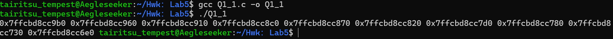
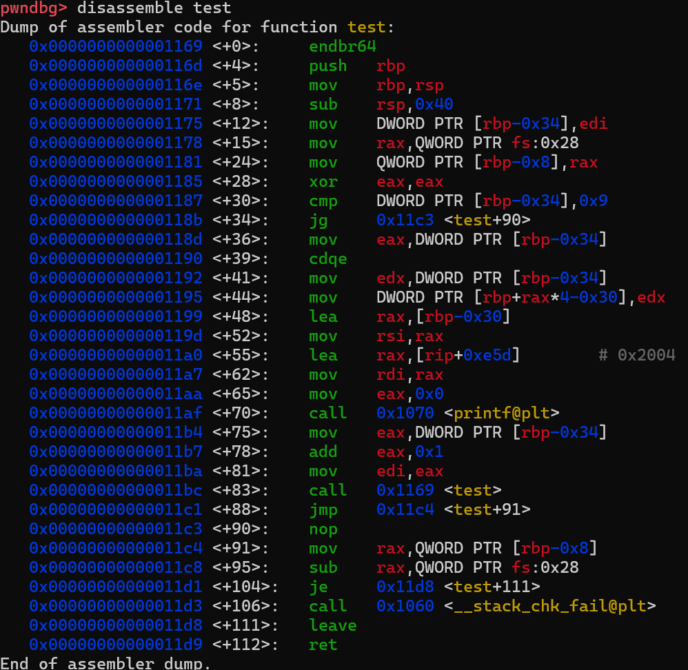
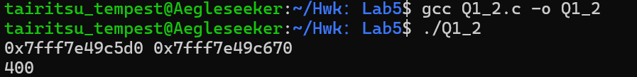
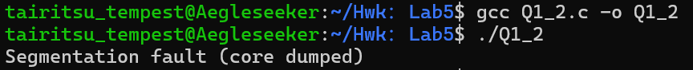
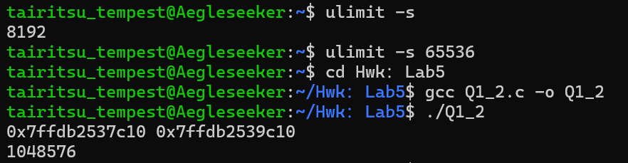
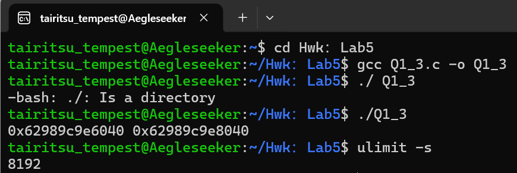
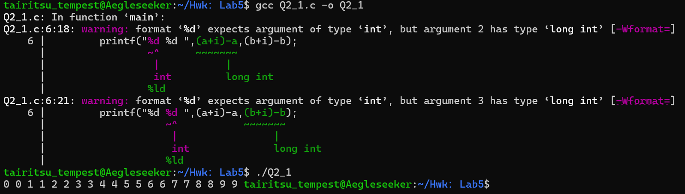
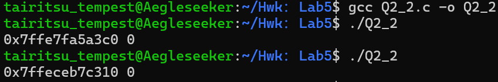
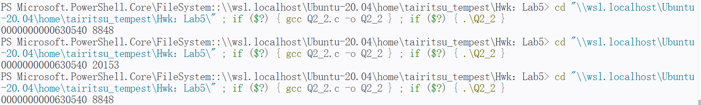

# Q1.

## (1)递归函数的分析

```c
#include<stdio.h>
void test(int i){
    int a[10];
    if(i>=10)return;
    a[i]=i;
    printf("%p ",(int*)&a);
    test(i+1);
}
int main(){
    test(0);
    return 0;
}
```

根据作业要求，可以创建这样的递归代码。运行后终端截图如下：



可以得到对应的地址为：

| i    | &a             | 地址差(&a_i-&a_{i+1}) |
| ---- | -------------- | ------------------------- |
| 0    | 0x7ffcbd8cc9b0 | 0x50                      |
| 1    | 0x7ffcbd8cc960 | 0x50                      |
| 2    | 0x7ffcbd8cc910 | 0x50                      |
| 3    | 0x7ffcbd8cc8c0 | 0x50                      |
| 4    | 0x7ffcbd8cc870 | 0x50                      |
| 5    | 0x7ffcbd8cc820 | 0x50                      |
| 6    | 0x7ffcbd8cc7d0 | 0x50                      |
| 7    | 0x7ffcbd8cc780 | 0x50                      |
| 8    | 0x7ffcbd8cc730 | 0x50                      |
| 9    | 0x7ffcbd8cc6e0 | ---                       |

发现每次相差的地址都是0x50.



可以发现，实际上是push压栈(0x8)--rsp预留空间(0x40)--返回地址(0x8)的流程导致相加起来正好是0x50.

## (2)

我们可以写成这样的代码：

```c
#include<stdio.h>
#define N 20
int main(){
    int i,j;
    long a[N][N];
    for(i=0;i<N;i++){
        for(j=0;j<N;j++){
            a[i][j]=(i+1)*(j+1);
        }
    }
    printf("%p %p\n", (void*)a[1], (void*)a[2]);
    printf("%ld\n",a[N-1][N-1]);
}   
```

此时的运行结果是:



假设我们将N改成1024:



发现此时系统会报错。

### a)

地址的差值为0xa0.

理由很显然：因为二维数组是行优先存放的，而在a[1]与a[2]中间相差的正好是一行，它们的地址差应该是20×8=160（wsl系统中long是8字节）

### b)

我们发现，将N宏定义为1024时即会失败。

### c)

理由分析：

大部分程序中局部变量不会很大，同时不太可能出现这种“离谱”的超大数组申请。再者，常见的函数调用一般只占比较小的栈空间。

### d)



经过查询相关资料，发现只需要输入指令

```bash
ulimit -s 65536
```

就可以有效解决这个问题了。

## (3)

根据题目要求，我们可以将数组的声明前置至函数之外。

```c
#include<stdio.h>
#define N 1024
long a[N][N];
int main(){
    int i,j;
    for(i=0;i<N;i++){
        for(j=0;j<N;j++){
            a[i][j]=(i+1)*(j+1);
        }
    }
    printf("%p %p\n", (void*)a[1], (void*)(a[2]));
}   
```

接下来在缺省状态下的终端中运行：



我们可以发现，此处的代码符合全局要求，同时系统分配的限额仍然是缺省值。

再观察地址：

|      | a[1]           | a[2] |
| ---- | -------------- | ---- |
| Q1_2 | 0x7ffdb2537c10 | 0x7ffdb2539c10 |
| Q1_3 | 0x62989c9e6040 |   0x62989c9e8040   |

我们发现地址偏移值没有变化，不过一个是局部变量一个是全局变量，所以绝对地址有所变化。

# Q2.

## (1)

相关代码为：

```c
#include<stdio.h>
int main(){
    int i;
    long a[10],b[10][100];
    for(i=0;i<10;i++){
        printf("%d %d ",(a+i)-a,(b+i)-b);
    }
}
```

我们可以发现，



结果不出意料——偏移值与i相同。实际上，在高维数组储存的时候是进行按行储存的，所以生成的结果将会是指向一行的指针之差。所以，(a+i)-a与(b+i)-b都会返回头地址与偏移i个元素之后所在地址对应的元素下标之差，也就是i本身。

## (2)

根据题意可以写出如下代码：

```c
#include<stdio.h>
void main(){
    short a[100]={0x0f0f};
    short *x=a+1000;
    printf("%p ",x);
    printf("%d \n",*x);
}
```



这里通过gcc -o编译的*x结果恒为0，而在其他不同编译条件下结果可能不一样



比如在vs code中的终端打开，每次访问到底将是随机垃圾值。本质上是对越界指针的处理方式不同导致的。

