# 1.预估修改内容

- [x] 进一步完成重构化的落实，将游戏的通用类跟具体类放入不同的子文件夹中；
- [x] 将 ProcessInput.java 中的具体逻辑下放；
- [x] 新增 Chess 游戏，并对游戏大厅中的注册表进行改动；
- [x] 对 Chess 中的复杂落子规则进行阐明，针对不同类型非法输入给出不同提示；
- [x] 细化边界条件约束并核验规则
- [x] 对每个游戏添加 Demo 按钮，通过预处理输入展示玩法
# 2. 增量设计点
 - 保留了悔棋功能，并且对其功能进行了维护；
 - 在 Chess 模式中给出了 Check 提示，用以给玩家提示，告知玩家当前情况；
# 3.新增/修改的关键类与职责
> common 部分
 - GameRegistry.java
   - 建立注册表，用来进一步将游戏大厅与游戏接口进行解耦；
 - GameDefinition.java,GameAction.java
   - 用来将各个游戏的行为统一化，形成一个“游戏大厅+后续接口”的形式
> chess 部分 
 - ChessBoard.java
   - 管理 Chess 中的大部分元素，包括双方的棋子 pieces:char[][],各子的移动位置legalMovesCache:Set\<Integer\>[][]等
 - ChessGame.java
   - 包含了一些游戏中会调用的方法，比如输入内容解析，判断是否正在被将军，判断当前盘面是否结束等；
> 其他核心类
 - GameSession.java
   - 游戏会话接口，定义游戏必须实现的行为（落子、悔棋、得分、演示脚本等）。
 - BoardView.java
   - 抽象棋盘视图接口，提供 `getSize()`、`getCell()` 等方法，供 UI 与规则类查询盘面。
 - ProcessInput.java
   - 全局输入解析器，负责将用户原始输入分类为 `QUIT/UNDO/SWITCH_BOARD` 等通用命令。
 - StringConstructer.java
   - 简单的字符串构建辅助类，用于在 UI 中拼接多行文本，替代直接使用 `StringBuilder`。
 - TerminalUI.java
   - 主界面驱动，负责布局、渲染棋盘、处理用户输入、触发 Demo 播放与按键交互。
 - TurnResult.java
   - 描述落子或动作结果的枚举（SUCCESS/INVALID_INPUT/WRONG_SIDE/...），供游戏与 UI 交互使用。

> chess 细分实现
 - ProcessInputInChess.java
   - 将棋类专用的落子格式解析为内部行列坐标，并按过期想起棋盘规范转换为内部索引。
 - SpecialMoveRule.java
   - 处理 王车易位/吃过路兵/升变 等特殊走法的识别与判定。
 - PawnRule.java / KnightRule.java / BishopRule.java / RookRule.java / QueenRule.java / KingRule.java
   - 按子类职责实现各个棋子合法走法判定，供 `ChessBoard` 的合法走法缓存使用。
 - ChessBoard.ChessBoardSnapshot
   - 棋盘快照结构，用于实现悔棋（undo）与状态回溯。

> 其他游戏实现（示例）
 - MinesweeperBoard / MinesweeperGame / MinesweeperBoardAdapter / MinesweeperBoardView
   - 分工：`Board` 负责格子状态与地雷逻辑，`Game` 负责游戏流程，`Adapter/View` 负责在通用 UI 下呈现 Minesweeper 特有行为。
 - Reversi.java / ReversiGame / ReversiBoardView
   - 反转棋的核心类，遵循 `GameSession/BoardView` 接口实现特有规则与显示。
 - PeaceGame.java
   - 示例游戏，用于演示多对局与简化规则实现。
 - KingRule.java,KnightRule.java,PawnRule.java,QueenRule.java等
   - 用来记录不同棋子的落子规则，同时保留了一些特殊规则的实现。
 - ChessRuleSupport.java
   - 用来实现游戏的落子规则。

# 4.国际象棋规则说明(参考资料：[click-here](https://zh.wikipedia.org/wiki/%E5%9C%8B%E9%9A%9B%E8%B1%A1%E6%A3%8B))
___
## 普通行棋规则
### 王（**K**ing）
是整个棋局中最为重要的棋子，不能被吃。横、直、斜走均可，但每次只能走一格，所走到的位置不可有对方棋子的威胁，吃子与走法相同。
### 后（**Q**ueen）
是威力最强的棋子。横、直、斜走均可，格数不限，但不可越过其他棋子。吃子和走法相同。
### 车（**R**ook）
也称为“城堡”，一如中国象棋，走法是横走或直走，格数不限，但不可斜走，也不可越过其他棋子。吃子与走法相同，另外有一种特殊的走法，称作“王车易位”。
### 主教（**B**ishop）
又称为“象”，只可斜走，格数不限，但不可转向，也不可越过其他棋子。吃子与走法相同 。开局时双方各有两象，一在白格，一在黑格，白格象只能在白格内移动，黑格象只能在黑格内移动。
### 骑士（K**n**ight）(为了跟王区分开，一般采用N表示)
也称为“马”，走法和中国象棋的馬相同，同样是走“日”字，或英文字母大写的“L”形：即先向左（或右）走1格，再向上（或下）走2格；或先向左（或右）走2格，再向上（或下）走1格。国际象棋的马没有“绊马脚”的限制，故马可越过其他棋子。吃子与走法相同。
### 兵（**P**awn）
兵第一步可前进一格或两格，以后每次只能前进一格，不可向后退或越过其他棋子。但吃对方棋子时，则是向位于斜前方的那格去吃（吃子和中国象棋的士／仕相同），另有一种特殊走法“吃过路兵”。
## 特殊行棋规则
### 1.吃过路兵
当一方的兵从原始位置向前一步走两格时，如果所到格同一横线的相邻格有对方的兵，则后者可以立即吃掉相邻的前者，但是占据原来位置的斜前方那一格，而不是前者原来占据的那格（换言之，后者此时可认为前者只行进了一格，从而直接斜进将其吃掉）。“吃过路兵”必须立即进行，否则即丧失权利。
### 2.升变
当兵走到对方的底线（即最远离己方的一行）时，必须升变为己方的车、马、象或后，但不能变成王，也不能选择不变或变为对方棋子。
### 3.王车易位
又称“入堡”，把王向车的方向打横移动两格，再把车直接移到王的另一侧，放在王的相邻一格。如果王与车之间有2格的称为“王翼易位”，俗称“短易位”；国王与车之间有3格的称为“后翼易位”，俗称“长易位”。
 - 使用王车易位的前提：
   - 国王和参与易位的车未被移动过。
   - 国王与要进行易位的车必须位处同一横行（即不能与王前兵升变所成之车易位）。
 - 如果发生以下情况之一，则暂时不能王车易位：
   - 当国王被将军时。
   - 国王和参与易位的车之间有棋子。
   - 国王所在的格，或易位时国王将要经过的格，或易位后国王将占据的格，正在受到对方一个或数个棋子的进攻。
# 5.多对局与动态新增流程截图
## 1) 开局界面变化
将游戏初始化为：1.Peace 2.Reversi 3.Minesweeper 4.Chess   
鉴于新增的 Chess 类游戏有专门的坐标编号规范，对棋盘的标注进行了一定的重构；

同时新增了 Demo 交互按钮方便用户进行交互

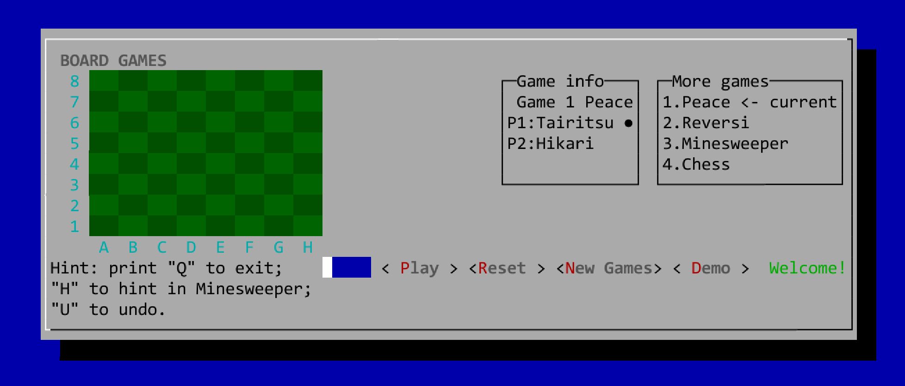

## 2)针对不同情况的 UI 文字提示

### a)正常行棋

正常行棋时，则会给出提示 move accepted ；

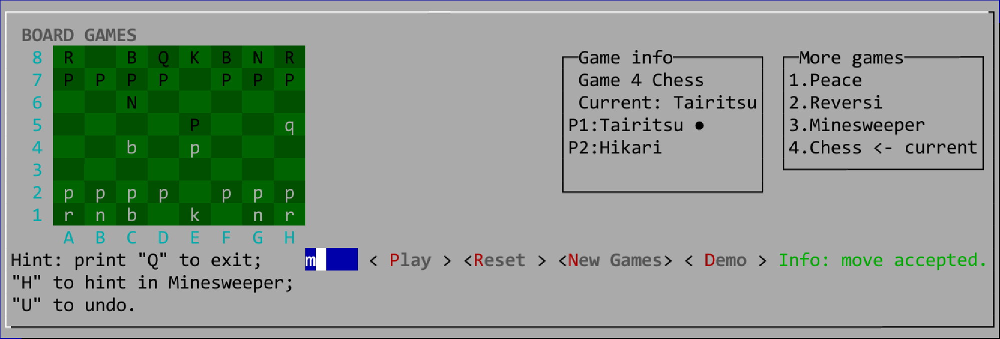

### b)错误信息

#### b1.选定的起始格没有棋子

若选中的格子没有棋子，将会弹出提示并阻止该操作；

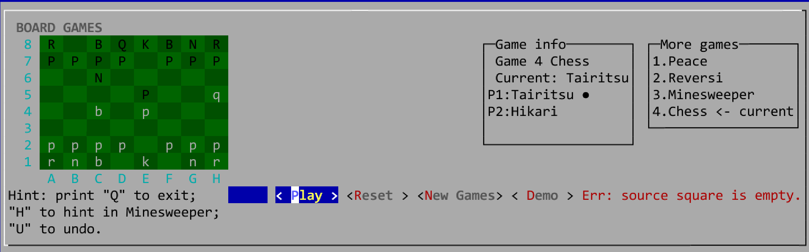

#### b2.选择移动对方的棋子

若选择的格子上的棋子属于对方 ，则会显示该棋子属于对方； 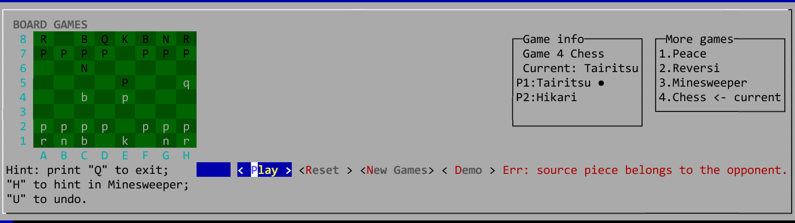

#### b3.选择移动的位置不可达

若给出的移动不符合国际象棋规则，则会给出提示：该移动不合法

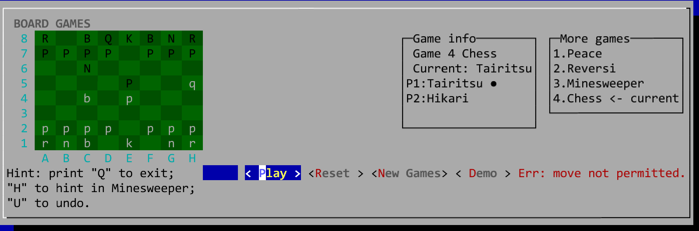

#### b4.输入不合法

若键入内容不符合格式或坐标超界，则会给出提示：输入无效，并给出正确的输入提示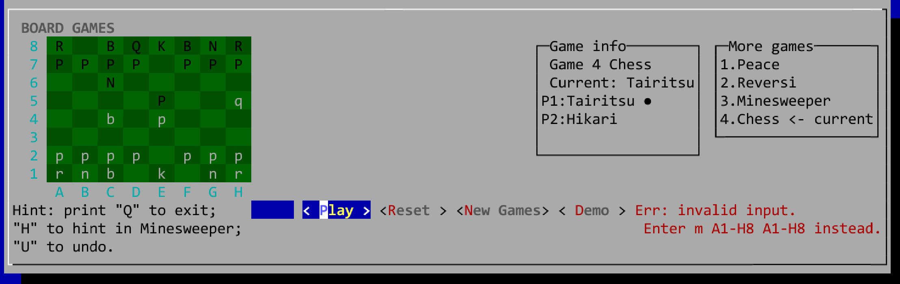

### c)将军提示

当某方正在被将军时，将会跳出提示 Check : xx，提升本版本的还原度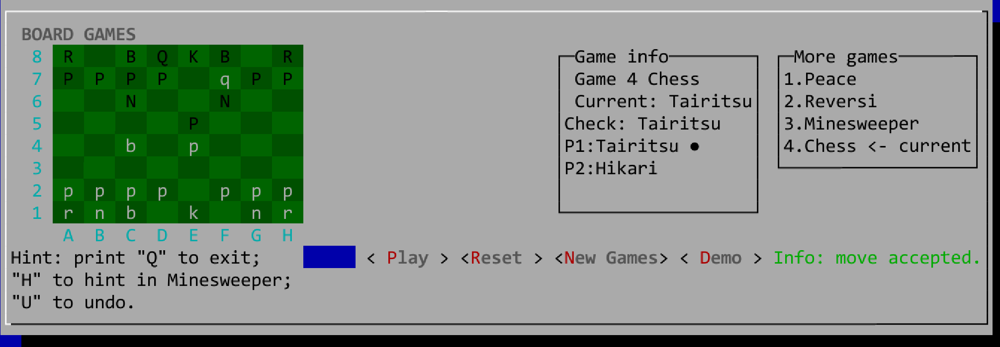

### d)游戏结束结算

当某方胜利时，将会跳出提示，结束该局。后续可以通过切换棋盘的形式回到本局查看。

注：鉴于需要，现在暂未实现对困毙逼和，无进攻子力逼和等情况的实现。胜利的判定条件为某方吃掉对方的王

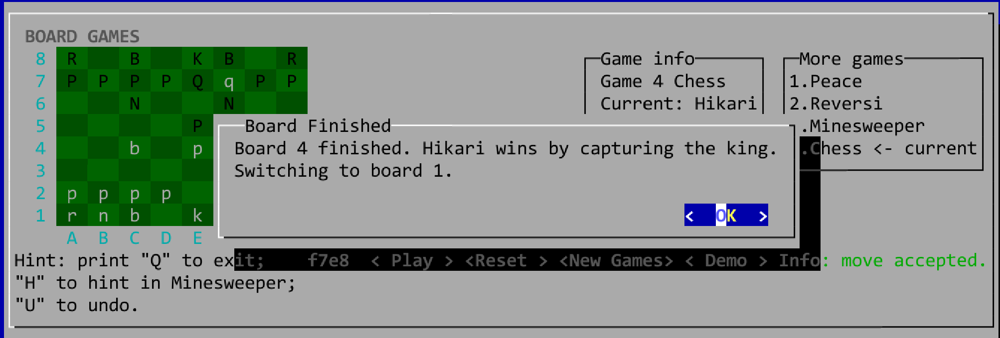

### e)悔棋操作

鉴于本游戏较为抽象，输入内容为坐标形式，增加了悔棋功能以便测试。键入'U'即可悔棋

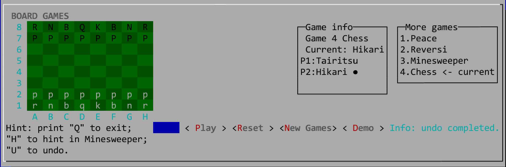

# 6.Demo 模式的流程截图(以 Chess 游戏为例)

## 1) Demo 模式启动

按下 Demo 键即可启动预览(自动播放，每0.5秒更新一步)。

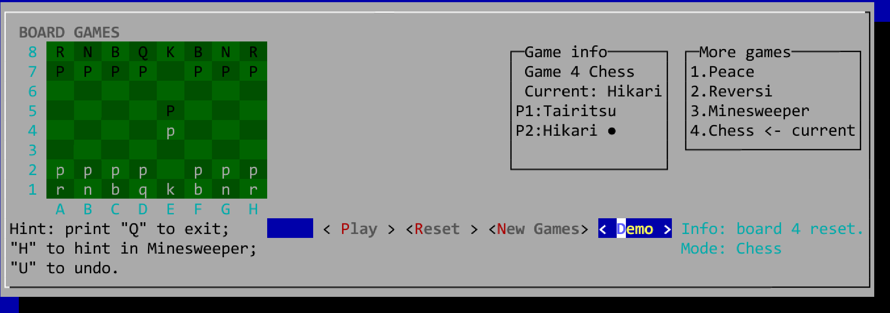

## 2) Demo 模式暂停

当目前存在正在运行的 Demo 时，再次与该键交互将会暂停到当前步，并进行显示。

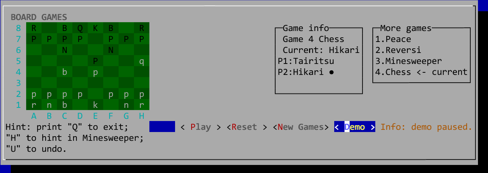

## 3) 输入阻断

当 Demo 未结束时(包括正在被暂停时)，所有输入将会被阻断，并给出提示：

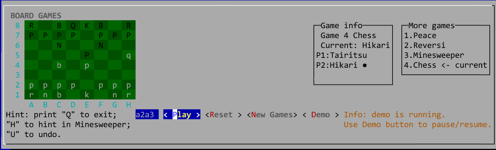

## 4) Demo 结束

当 Demo 时，将会显示步数并告知玩家演示结束。

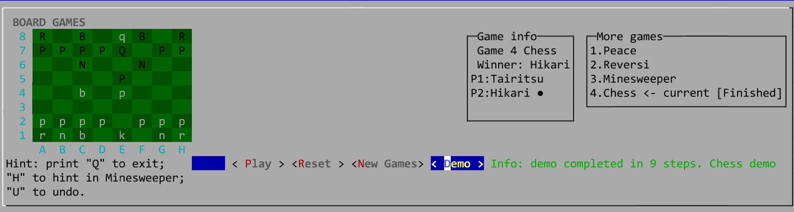
